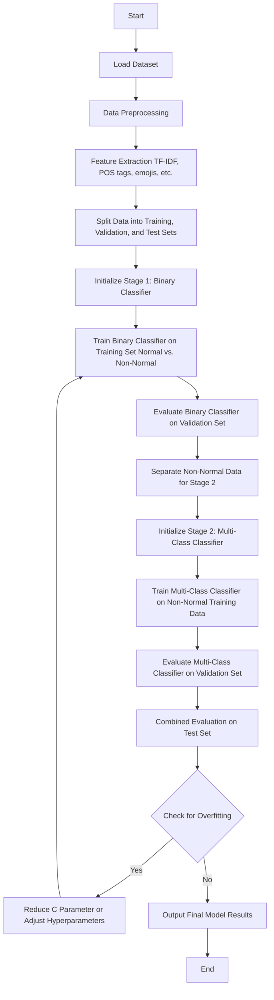

# Sentiment Analysis for Mental Health Monitoring 🤯
---

NLP course homework, focusing on mental health text classification. Implements data preprocessing, POS filtering with Stanza, TF-IDF vectorization, and model training to detect mental health conditions.


---

___

> [dataset source](https://www.kaggle.com/datasets/suchintikasarkar/sentiment-analysis-for-mental-health) 🔗

---

## **About The Datset** 🧷
This comprehensive dataset is a meticulously curated collection of mental health statuses tagged from various statements. The dataset amalgamates raw data from multiple sources, cleaned and compiled to create a robust resource for developing chatbots and performing sentiment analysis.

---
## **Data Souce** 🌍
The dataset integrates information from the following Kaggle datasets:

 - 3k Conversations Dataset for Chatbot
 - Depression Reddit Cleaned
 - Human Stress Prediction
 - Predicting Anxiety in Mental Health Data
 - Mental Health Dataset Bipolar
 - Reddit Mental Health Data
 - Students Anxiety and Depression Dataset
 - Suicidal Mental Health Dataset
 - Suicidal Tweet Detection Dataset
---

###  **Datset Over View**  :

* **Description:**

    This dataset is a comprehensive collection of 50,000 text statements related to mental health, each tagged with one of seven mental health statuses. The primary purpose of this dataset is to assist in building machine learning models for classifying mental health conditions based on textual data, such as social media posts or other user-generated content.

* **Columns:**
  1. **unique_id**: A unique identifier for each entry.
  2. **statement**: A piece of text, typically a statement or comment, associated with a particular mental health status.
  3. **status**: The mental health status assigned to the statement. The possible categories are:
    - Normal
    - Depression
    - Suicidal
    - Anxiety
    - Stress
    - Bi-Polar
    - Personality Disorder

---
### **Usage** :
This dataset is ideal for training machine learning models aimed at understanding and predicting mental health conditions based on textual data.
It can be used in various applications such as:

- Chatbot development for mental health support.
- Sentiment analysis to gauge mental health trends.
-
---

### **How we use NLP Concepts**


  In our text processing methodology, we begin by removing punctuation, URLs, and hyperlinks from the statements. Additionally, we eliminate stop words, such as "is," "are," and "the," to enhance the focus on more informative terms.


  In the realm of morphological analysis, we extract the stems of the words. Subsequently, we employ a TF-IDF (Term Frequency-Inverse Document Frequency) vectorizer to transform the processed text into a vector representation. This vector is then utilized to fit the mode

  In the realm of POS, we split the statemetn to three field ,for verbs, nouns, adjectvies column , and the we make a four TF-IDF Vectors as the folowing :
    1. Verb TF-IDF Vector
    2. Nouns TF-IDF Vector
    3. Adjective TF-IDF Vector 
    4. Weighted TF-IDF Vector
    
---
## Two-Level Classification
___


---

### About Two-Level Classification

In a two-level classification approach, we break down a multi-class classification problem into two stages:

1. **Stage 1 - Binary Classification**:
   - This stage first classifies data into two  categories: **Normal** ans **Non-Normal**.
   - By creating this separation, we simplify the problem and reduce the initial complexity, allowing the model to focus on distinguishing between these high-level classes.
   - This binary classifier uses features from the full dataset, ensuring that it can accurately detect if a statement falls into the "Normal" or "Non-Normal" category.

2. **Stage 2 - Multi-Class Classification**:
   - In this stage, we take statements classified as **Non-Normal** from Stage 1 and further classify them into specific mental health categories such as **Depression**, **Suicidal**, **Anxiety**, **Stress**, **Bi-Polar**, and **Personality Disorder**.
   - This multi-class classifier uses data that has already been identified as "Non-Normal," focusing on differentiating among various mental health conditions.
   
### Why Two-Level Classification?

- 🌵**Improved Accuracy**: This approach allows each classifier to focus on a subset of the problem, potentially increasing accuracy by reducing the complexity each model has to handle.
- 🍀 **Efficient Use of Resources**: By filtering out "Normal" cases in Stage 1, Stage 2 can concentrate only on differentiating among the specific mental health conditions, making it more efficient.
- 🦠 **Handling Imbalance**: Many datasets are imbalanced, with "Normal" cases being more common. Splitting the classification into two levels allows us to address class imbalance in each level separately.

### How It Works in This Model

1. **Data Preparation**:
   - First, we preprocess the dataset by cleaning the text and extracting features (e.g., TF-IDF, POS tags, emojis).
   - Then, we split the data for training and testing each stage separately.

2. **Training**:
   - **Stage 1**: We train a binary classifier on the full training data to classify statements as **Normal** or **Non-Normal**.
   - **Stage 2**: We train a multi-class classifier on the subset of training data labeled as **Non-Normal**, focusing only on the six specific mental health conditions.

3. **Testing**:
   - For each test instance, we first use Stage 1 to determine if it’s "Normal" or "Non-Normal."
   - If classified as **Non-Normal**, the instance is passed to Stage 2, where it is classified into one of the specific mental health categories.

### Evaluation and Metrics

- **Stage-Specific Metrics**: Each stage is evaluated separately, with accuracy, recall, precision, and F1-score measured for both the binary and multi-class classifiers.
- **Combined Evaluation**: Finally, we combine predictions from both stages to evaluate the overall performance of the two-level classification system.

This two-level approach allows us to accurately identify both "Normal" and specific mental health conditions, leveraging targeted classification strategies to improve overall accuracy and interpretability.


---
# Text Processing Workflow

This document outlines the workflow for preprocessing text data by expanding slang terms and counting their occurrences.

## Workflow



---
### **Conlusion**
 *  in the conclusion  for the moph part 1, we train and tune  a four model wich is :
    * SVM  
    * Logistic Regression
    * Neural Ntwork
    * KNN
  the first three give a Convergent results with accuracy near to 76 % , and the last one give  a 65 % acc .
*  in the pos part 2 , we train the model on each vector from the vectors that mentioned above, and the results was as the following:

| Model                  | Vectorizing Approach         | Accuracy |
|------------------------|------------------------------|----------|
| Logistic Regression    | TF-IDF Based on Verbs        | 66%      |
| Logistic Regression    | TF-IDF Based on Nouns        | 66%      |
| Logistic Regression    | TF-IDF Based on Adjective    | 60%      |
| Logistic Regression    | TF-IDF Based on Weightes     | 75%      |
| Neural Network         | TF-IDF Based on Verbs        | 64%      |
| Neural Network         | TF-IDF Based on Nouns        | 68%      |
| Neural Network         | TF-IDF Based on Adjective    | 46%      |
| Neural Network         | TF-IDF Based on Weightes     | 72%      |

*  
---
---


---
```


```
---


